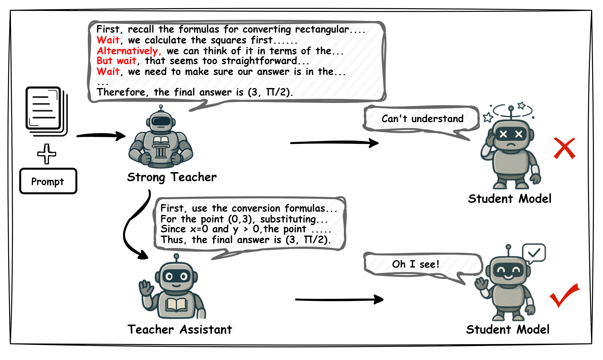

# MiCoTA: Mitigating the Learnability Gap in Mathematical Reasoning via Intermediate Chain-of-Thought and Teacher Assistants
## 📌 Overview



## 🛠 Installation

```bash
git clone https://github.com/yourusername/micota.git
cd micota
pip install -r requirements.txt
```

## 📊 Data Processing

To generate training data from raw sources:

```bash
bash scripts/run_data_processing.sh
```

**Output**: Processed data will be saved to `data/processed/filtered_result.json` with the following structure:
```json
{
    "instruction": "...",
    "output": "...",
    "answer": "...",
    "resp_answer": "..."
}
```

## 🧠 Model Architecture

### Merging Strategies
We adopted [DARE](https://arxiv.org/abs/2311.03099) as our model merging method.

##### Build Environment
```bash
cd mergekit
conda create -n mergekit
conda activate mergekit
pip install -e . 
```

We use mergekit framework for model merging. Run the merge and write your merged model to saves/model.
```bash
mergekit-yaml configs/dares_ties.yml saves/model
```

### Training Configuration
We use LLaMA-Factory framework for model training.

##### Build Environment
```bash
cd LLaMA-Factory
conda create -n llama_factory python=3.10
conda activate llama_factory
pip install -e ".[torch,metrics]"
pip install deepspeed
```

Configure training parameters in YAML files:

```bash
llamafactory-cli train configs/3B.yaml
```

## 📈 Evaluation
We employ lm-evaluation-harness, which is a tool for evaluating the performance of the fine-tuned models.

#### Build Environment
```bash
cd lm-evaluation-harness
conda create -n lm-evaluation-harness
conda activate lm-evaluation-harness
pip install -e .
```
We provide comprehensive evaluation across multiple mathematical reasoning benchmarks:

```bash
lm_eval --model vllm \
    --model_args "pretrained=Model_Path,tensor_parallel_size=4,gpu_memory_utilization=0.85,max_model_len=16000,enforce_eager=True" \
    --tasks gsm8k_zero,AMC,AIME,Olympiad,hendrycks_math_500  \
    --batch_size auto \
    --gen_kwargs do_sample=false,temperature=0,max_gen_toks=16000 \
    --output_path results/micota \
    --apply_chat_template \
    --log_samples 
```
For the AMC, AIME, Olympiad, and hendrycks_math_500 tasks, we leverage the customized evaluation tasks and scripts from the [Small-Model-Learnability-Gap](https://github.com/Small-Model-Gap/Small-Model-Learnability-Gap) repository. Specifically, we adopted the task configurations and evaluation frameworks provided in the `lm-evaluation-harness` directory to assess model performance on complex reasoning benchmarks. 

This implementation is based on the original work released under the [MIT License](https://github.com/Small-Model-Gap/Small-Model-Learnability-Gap/blob/main/LICENSE), and we thank the authors for their open-source contributions.

### Benchmark Details

| Task | Dataset | Description |
|------|---------|-------------|
| GSM8K | Grade School Math | Basic arithmetic and reasoning |
| AMC | American Math Competition | Advanced problem solving |
| AIME | Math Olympiad | Competition-level problems |
| OlympiadBench | Math Olympiad | Olympiad-level problems |
| Hendrycks Math | Comprehensive Test | Diverse mathematical concepts |


## 📜 License

This project is licensed under the Apache License 2.0 - see the [LICENSE](LICENSE) file for details.

## 📚 Citation

If you use MiCoTA in your research, please cite our work:

```bibtex
@article{micota2025,
  title={MiCoTA: Bridging the Learnability Gap in Mathematical Reasoning with Intermediate Chain-of-Thought and Teacher Assistants},
  tbd={tbd}
}
```

